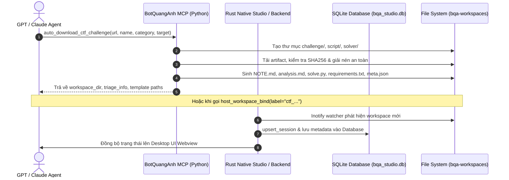

# Cấu Trúc Thư Mục Chuẩn Mực & CTF Harness — BotQuangAnh MCP

Tài liệu này định nghĩa chuẩn mực phân chia thư mục của hệ thống **BotQuangAnh MCP** và quy chuẩn tạo không gian làm việc (harness) tự động cho mọi phiên giải CTF của GPT/LLM.

---

## 1. Cấu Trúc Tổng Thể Dự Án (Repository Structure)

Dự án được tổ chức theo mô hình **Clean Modular Architecture** kết hợp giữa Python FastMCP Server và Rust Native Studio:

```
botquanganh_mcp/
├── app/                           # Lớp Python FastMCP Server & Nghiệp Vụ MCP
│   ├── ctf/                       # CTF Core Engine
│   │   ├── challenge_harness.py   # Tự động hóa tạo harness, download và giải nén artifacts
│   │   ├── hash_tool.py           # Nhận diện chữ ký hash và tính toán mã băm offline
│   │   ├── pattern.py             # Sinh De Bruijn cyclic pattern và tìm offset tràn bộ nhớ
│   │   ├── transform.py           # Bộ biến đổi encoding đa năng (B64, Hex, URL, XOR, ROT13, Zlib)
│   │   └── triage.py              # Phân tích chữ ký tệp, ELF headers, magic bytes
│   ├── core/                      # Quản trị phiên làm việc và bảo mật
│   │   ├── command_policy.py      # Bộ lọc lệnh, honeypot detection, canary protection
│   │   ├── context.py             # Trạng thái session và metadata
│   │   └── workspace_journal.py   # Ghi nhật ký hoạt động (journal.jsonl)
│   ├── gateway/                   # HTTP Gateway & Cloudflared Tunnel
│   │   ├── auth.py                # Bearer token verification
│   │   ├── proxy.py               # Reverse proxy endpoint
│   │   └── server.py              # ASGI FastMCP server daemon
│   ├── tools/                     # Bề mặt 23 Tools MCP cung cấp cho GPT
│   │   ├── ctf_suite.py           # Các tool CTF (auto_download_ctf_challenge, ctf_transform, ...)
│   │   ├── host.py                # host_run_command, host_read_file, host_write_file...
│   │   ├── workspace_tools.py     # host_workspace_bind, host_workspace_status, host_save_note
│   │   └── health.py              # host_health, host_knowledge
│   ├── config.py                  # Cấu hình môi trường toàn cục (.env)
│   └── mcp_server.py              # FastMCP instance và system instructions
│
├── crates/                        # Lớp Rust Native Studio (Clean Architecture)
│   └── bqa_desktop/               # Ứng dụng Desktop Native (Frontend + Backend + Database)
│       ├── Cargo.toml             # Dependencies (Tao, Wry, Rusqlite, Tokio, Notify)
│       ├── src/
│       │   ├── frontend/          # Tầng hiển thị & giao diện người dùng
│       │   │   └── mod.rs         # Khởi tạo Tao Window, Webview, Event Loop
│       │   ├── backend/           # Tầng nghiệp vụ xử lý hệ thống
│       │   │   ├── ctf_harness.rs # Module Rust tạo harness cho CTF challenges
│       │   │   ├── ipc.rs         # Bộ điều phối tin nhắn IPC hai chiều
│       │   │   ├── paths.rs       # Quản trị đường dẫn, tìm kiếm workspace và dotenv
│       │   │   ├── runtime.rs     # Giám sát trạng thái daemon FastMCP & Tunnel qua /proc, pgrep
│       │   │   ├── sanitizer.rs   # Làm sạch honeypot, clipboard handler
│       │   │   └── scanner.rs     # Quét workspace, phân tích journal, log audit
│       │   ├── db/                # Tầng cơ sở dữ liệu SQLite
│       │   │   └── mod.rs         # Database engine: sessions, commands, flags, audit logs
│       │   └── main.rs            # Entry point kết nối Frontend, Backend và Database
│       └── ui/
│           └── index.html         # Giao diện Modern Webview (HTML5/Tailwind/JS)
│
├── knowledge/                     # Tri Thức & Playbook Cho AI Agent
│   ├── CTF_TOOLKIT_PLAYBOOK.md    # Playbook giải CTF bài bản theo flow chuẩn mực
│   └── WORKING_GUIDE.md           # Hướng dẫn thao tác workspace và tool gating
│
├── docs/                          # Tài Liệu Kỹ Thuật
│   ├── ARCHITECTURE.md            # Thiết kế kiến trúc Front-end / Back-end / Database
│   └── DIRECTORY_STRUCTURE.md     # Tài liệu chuẩn hóa cấu trúc thư mục (file này)
│
├── tests/                         # Bộ Test Suite Toàn Diện
│   ├── test_challenge_harness.py  # Kiểm thử tải file và dựng harness
│   ├── test_tool_surface.py       # Kiểm thử 23 tool MCP
│   ├── test_health.py             # Kiểm thử endpoint healthz
│   └── test_enforce_gating.py     # Kiểm thử an toàn session & gating
│
└── pyproject.toml                 # Cấu hình uv / python project
```

---

## 2. Quy Chuẩn Không Gian Làm Việc Cho Từng Session (CTF Harness)

Mỗi khi GPT tạo một phiên làm việc mới (bằng cách gọi `auto_download_ctf_challenge` hoặc `host_workspace_bind(label="ctf_...")`), hệ thống **BẮT BUỘC** tự động trang bị cấu trúc 3 thư mục chuẩn mực:

```
<workspace_root>/cw-<timestamp>-<challenge_name>/
├── challenge/                     # [VÙNG CHỈ ĐỌC] — Artifacts gốc
│   ├── <binary_or_archive>        # Tệp nhị phân, source code, PCAP, file mã hóa tải về
│   └── NOTE.md                    # Bản ghi tri thức tĩnh về challenge
│
├── script/                        # [VÙNG THĂM DÒ] — Scripts & phân tích nháp
│   ├── probes/                    # Scripts nhỏ kiểm tra giả thuyết, fuzz payloads
│   └── analysis.md                # Ghi chép sống: Facts, Hypotheses, Dead Paths
│
├── solver/                        # [VÙNG EXPLOIT CHÍNH THỨC] — Mã giải độc lập
│   ├── solve.py                   # Script giải hoàn chỉnh, deterministic
│   └── requirements.txt           # Thư viện Python cần thiết để chạy standalone
│
├── meta.json                      # Metadata phiên làm việc (label, category, target, flags)
└── journal.jsonl                  # Nhật ký audit log toàn bộ thao tác lệnh
```

---

## 3. Vai Trò Và Nhiệm Vụ Từng Thư Mục Con

### A. Thư mục `challenge/` (Chỉ Đọc)
- **Mục đích**: Bảo toàn tính nguyên bản của đề bài.
- **Trang bị sẵn**:
  - Tệp tải về và các tệp sau khi tự động giải nén (an toàn, chống Zip-Slip).
  - Tệp `NOTE.md` ghi sẵn:
    - Danh sách sha256 checksum của từng file.
    - Kết quả phân tích triage ban đầu (`file`, `checksec`, architecture, magic bytes).
    - Remote target (Host:Port hoặc Web URL).
    - Quy tắc cấm sửa đổi file trong thư mục này.

### B. Thư mục `script/` (Thăm Dò & Thử Nghiệm)
- **Mục đích**: Nơi GPT viết code thử nghiệm, giải mã nháp, dump bộ nhớ, trace logic.
- **Trang bị sẵn**:
  - Thư mục con `script/probes/` chứa các đoạn code ngắn thăm dò.
  - Tệp `analysis.md` với template:
    1. **Initial Triage & Recon**: Bằng chứng kỹ thuật thu thập được.
    2. **Hypotheses & Tests**: Các giả thuyết đang kiểm chứng.
    3. **Eliminated / Dead Paths**: Ghi lại các đường thử thất bại kèm nguyên nhân để không lặp lại sai lầm.

### C. Thư mục `solver/` (Mã Giải Chuẩn)
- **Mục đích**: Chứa mã giải cuối cùng có thể chạy độc lập (standalone) và tái lập 100%.
- **Trang bị sẵn**:
  - `solve.py`: Template phù hợp với từng phân loại:
    - **pwn**: Tích hợp sẵn `pwntools`, cấu hình remote/local, template leak libc & dispatch payload.
    - **crypto**: Tải tham số, logic nghịch đảo / SMT / RSA / LLL, trích xuất flag.
    - **web**: `requests.Session`, CSRF extraction, SQLi/SSTI/XSS payload dispatch.
    - **reverse**: Constraint solver với `z3-solver` hoặc brute-force logic.
  - `requirements.txt`: Khai báo các dependency để bất kỳ ai cũng có thể `pip install -r requirements.txt` và chạy được `solve.py`.

---

## 4. Cơ Chế Tự Động Kích Hoạt (Automation Flow)



Mọi phiên làm việc được khởi tạo đều ngay lập tức tuân thủ đúng kỷ luật này, giúp AI không tạo file rác lung tung và có môi trường làm việc chuyên nghiệp, có cấu trúc.
