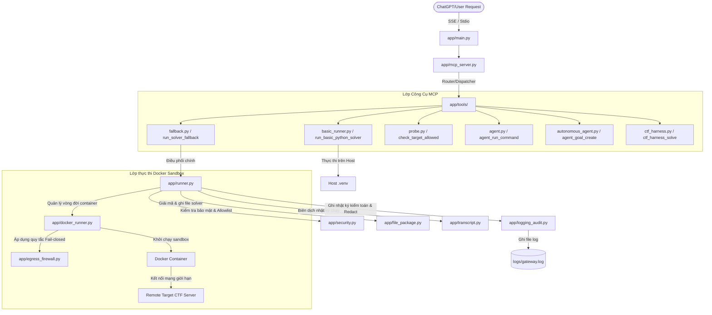

# Master Guide: Fallback Runner MCP

Tài liệu này hướng dẫn chi tiết cách cài đặt, cấu hình, vận hành và giải thích chi tiết cấu trúc mã nguồn, vai trò cũng như cách thức hoạt động của từng tệp tin trong dự án **Fallback Runner MCP**.

---

## 1. Kiến Trúc & Sơ Đồ Hoạt Động

Dự án là một máy chủ MCP (Model Context Protocol) cho phép ChatGPT kết nối an toàn với máy trạm cục bộ của bạn để chạy kiểm tra mạng, thử nghiệm solver, quản lý không gian làm việc thách thức CTF (Capture The Flag) và thực hiện các kế hoạch khai thác tự động trong môi trường sandbox Docker cô lập.

### 1.1 Sơ đồ luồng xử lý yêu cầu chạy Solver



---

## 2. Chi Tiết Vai Trò & Cách Hoạt Động Của Từng Tệp Tin

Dưới đây là bảng phân tích chi tiết của từng tệp tin trong dự án để phục vụ việc lập trình và bảo trì.

### 2.1 Thư mục Lõi `app/`

| Đường dẫn tệp tin | Vai trò chính | Cách thức hoạt động chi tiết |
| :--- | :--- | :--- |
| `app/__init__.py` | Khởi tạo package Python | Đánh dấu thư mục `app/` là một package Python để các module khác import. |
| `app/auth.py` | Quản lý xác thực API Token | Cung cấp các hàm `verify_token` và `require_token` để so khớp mã bí mật với `GATEWAY_TOKEN` cấu hình bằng thuật toán an toàn so sánh thời gian không đổi (constant-time comparison). |
| `app/config.py` | Định nghĩa biến môi trường & Cấu hình | Đọc các biến cấu hình từ tệp `.env`. Cấu hình thư mục lưu trữ, giới hạn kích thước file, thời gian chạy tối đa (timeout), tham số Docker (Memory, CPU, PIDs Limit, User) và các cờ bật/tắt tính năng nâng cao. |
| `app/docker_runner.py` | Quản lý vòng đời Docker Container | Ánh xạ loại ngôn ngữ (python, pwn, sage, forensics) sang Docker image tương ứng. Khởi chạy container detached với lệnh `sleep`, gắn các ổ đĩa mount chung thư mục đầu vào (`/work`), thiết lập các biến môi trường target, gọi lệnh thực thi solver và tự động thu hồi/dọn dẹp container khi chạy xong hoặc gặp sự cố. |
| `app/egress_firewall.py` | Thiết lập tường lửa cô lập mạng container | Sử dụng lệnh `sudo iptables` để chèn luật chặn hoàn toàn lưu lượng đi ra từ IP của container vào chuỗi `DOCKER-USER`, đồng thời chỉ chèn một luật cho phép duy nhất đến IP và Port của host mục tiêu (target). Áp dụng cơ chế **Fail-closed** để bảo vệ hệ thống: nếu quá trình cấu hình firewall lỗi, tiến trình solver sẽ bị hủy ngay lặp tức. |
| `app/file_package.py` | Giải mã, xác thực và ghi file payload | Kiểm tra bảo mật chống tấn công Path Traversal đối với các file nguồn solver. Giải mã dữ liệu đầu vào (hỗ trợ Text và Base64) hoặc nạp từ kho lưu trữ Artifact. Ghi các file này vào thư mục đầu vào của run_id một cách an toàn, đảm bảo không bị thoát ra ngoài thư mục quy định. |
| `app/logging_audit.py` | Ghi nhật ký kiểm toán hệ thống (Audit Log) | Thiết lập ghi log vào cả màn hình console và tệp `logs/gateway.log` dưới dạng JSON để thuận tiện phân tích. Tích hợp cơ chế tự động che giấu (redact) các dữ liệu nhạy cảm xuất hiện trong cấu hình hoặc payload (chìa khóa riêng tư, token, mật khẩu, cookies). |
| `app/main.py` | Điểm khởi chạy máy chủ MCP | Điểm khởi chạy chính. Thiết lập ASGI Middleware xác thực Token (`TokenAuthMiddleware`), tích hợp kênh kết nối thời gian thực WebSocket và chạy máy chủ phục vụ giao tiếp Stdio hoặc HTTP SSE. |
| `app/mcp_server.py` | Cấu hình máy chủ và vá lỗi tương thích | Kích hoạt máy chủ `FastMCP`. Áp dụng các bản vá đặc biệt để tương thích với máy khách ChatGPT: chấp nhận mọi Content-Type, gán các POST request không session vào phiên SSE hoạt động gần nhất, kết hợp các route GET và POST của SSE để phòng lỗi 405 Method Not Allowed. |
| `app/runner.py` | Điều phối chu trình chạy solver | Tạo ID chạy duy nhất, thiết lập thư mục tạm, gọi `file_package` ghi file, gọi bộ chạy Docker (`docker_runner`) hoặc bộ chạy cục bộ trên host, xử lý cắt ngắn đầu ra stdout/stderr nếu quá dài, kích hoạt tạo transcript và ghi nhận metadata kết quả. |
| `app/schemas.py` | Định nghĩa mô hình dữ liệu Pydantic | Khai báo các lớp dữ liệu đầu vào/đầu ra cho các công cụ MCP để tự động hóa kiểm tra kiểu dữ liệu và định cấu hình mặc định (ví dụ: `Target`, `SandboxFailure`, `LocalValidation`, `FallbackRequest`, v.v.). |
| `app/security.py` | Lọc bảo mật & Định dạng lỗi | Cung cấp các hàm kiểm tra địa chỉ IP riêng tư/mạng nội bộ để ngăn chặn quét cổng cục bộ, kiểm tra target có nằm trong danh sách allowlist, xác thực giới hạn tham số lệnh shell, kiểm tra path traversal và định dạng chuẩn hóa lỗi hệ thống trước khi trả về client. |
| `app/transcript.py` | Biên soạn biên bản thực thi | Tổng hợp toàn bộ dữ liệu chạy thử thách (run_id, target, sandbox failure, local validation, files, command, stdout, stderr, exit code, duration) thành tệp `transcript.txt` theo đúng đặc tả. Tính toán mã băm SHA-256 của các thành phần và gán vào cuối biên bản để phục vụ việc xác thực tính toàn vẹn. |

---

### 2.2 Thư mục Công Cụ `app/tools/`

Thư mục này đăng ký trực tiếp các API (tools) lên máy chủ MCP để ChatGPT có thể gọi trực tiếp.

| Tên tệp tin | Danh sách Tools đăng ký | Chức năng & Cách hoạt động |
| :--- | :--- | :--- |
| `app/tools/__init__.py` | *Không có* | Đánh dấu thư mục package công cụ. |
| `app/tools/agent.py` | `agent_list_directory`<br>`agent_read_file`<br>`agent_write_file`<br>`write_file`<br>`agent_edit_file`<br>`replace_in_file`<br>`append_file`<br>`mkdir_p`<br>`agent_grep_search`<br>`agent_run_command` | Nhóm công cụ dành cho Agent để tương tác với hệ thống tệp tin và chạy lệnh trên máy trạm host của bạn. Các công cụ này tuân thủ cấu hình giới hạn thư mục gốc làm việc (`AGENT_WORKSPACE_DIR`) và lọc lệnh cấm để bảo đảm an toàn. |
| `app/tools/autonomous_agent.py` | `agent_goal_create`<br>`agent_toolchain_capabilities`<br>`agent_step`<br>`agent_goal_start`<br>`agent_status`<br>`agent_cancel`<br>`agent_report` | Cung cấp khả năng lập kế hoạch giải quyết thách thức tự động cho Agent. Cho phép tạo mục tiêu giải bài, phân tích xem máy trạm có các công cụ giải bài tương ứng (Web, Pwn, Crypto, Forensics, Reversing) không và chạy từng bước kế hoạch (hỗ trợ chế độ chạy liên tục continuous mode). |
| `app/tools/basic_runner.py` | `run_basic_python_solver` | Chạy solver Python trực tiếp trong môi trường ảo `.venv` trên host. Thích hợp cho các kết nối gọn nhẹ không yêu cầu cách ly mạng sâu bằng Docker. Hỗ trợ import các thư viện CTF thông dụng. |
| `app/tools/ctf_harness.py` | `ctf_harness_capabilities`<br>`ctf_harness_instructions`<br>`ctf_harness_init`<br>`ctf_harness_check`<br>`ctf_harness_local`<br>`ctf_harness_solve`<br>`ctf_harness_verify`<br>`ctf_harness_report`<br>`ctf_harness_pack` | Cầu nối tích hợp giữa máy chủ MCP và CLI `ctfharness`. Hỗ trợ ChatGPT quản lý vòng đời phát triển mã khai thác một thử thách theo SOP tiêu chuẩn. |
| `app/tools/environments.py` | `get_runner_environments` | Trả về danh sách chi tiết các công cụ dòng lệnh và thư viện Python/Sage đã được cài đặt sẵn bên trong từng Docker image tương ứng để ChatGPT biết cách viết mã khai thác tương thích. |
| `app/tools/fallback.py` | `run_solver_fallback`<br>`validate_run_request`<br>`upload_artifact`<br>`rerun_run` | Nhóm công cụ thực thi solver trong container Docker. Đòi hỏi phải có lý do lỗi kết nối từ sandbox ChatGPT và minh chứng đã giải thử thành công trên local trước khi cho phép chạy trên máy host. Hỗ trợ vá tham số và chạy lại. |
| `app/tools/github_ops.py` | `github_clone_or_sync`<br>`github_list_prs`<br>`github_open_pr`<br>`github_get_run_logs` | Công cụ tự động hóa thao tác mã nguồn trên GitHub qua lệnh `gh` CLI. Tránh việc gọi shell thô và đảm bảo tính nhất quán khi quản lý các PR hoặc kiểm tra nhật ký Actions. |
| `app/tools/health.py` | `health_check`<br>`get_capabilities` | Công cụ kiểm tra sức khỏe máy chủ MCP và xem danh sách các tool khả dụng kèm giới hạn tài nguyên hệ thống hiện tại. |
| `app/tools/probe.py` | `check_target_allowed`<br>`probe_target_from_runner`<br>`tcp_connect_ssl` | Hỗ trợ chẩn đoán kết nối mạng. Cho phép kiểm tra địa chỉ có bị cấm không, thử nghiệm chẩn đoán DNS/TCP/TLS từ máy host đến mục tiêu từ xa và thiết lập kết nối SSL để bắt banner. |
| `app/tools/runs.py` | `get_run_log`<br>`list_recent_runs`<br>`get_run_summary`<br>`delete_run`<br>`get_run_stdout`<br>`get_run_stderr`<br>`tail_run_output`<br>`build_ctf_proof_bundle` | Nhóm công cụ quản trị các phiên chạy thử thách trước đây. Hỗ trợ xem lại log, tail đầu ra, xóa phiên chạy cũ và xuất tệp minh chứng JSON chứa mã băm toàn vẹn cùng các cờ flag tìm được. |
| `app/tools/shell.py` | `run_host_command`<br>`run_workspace_command`<br>`policy_check_command` | Nhóm công cụ thực thi shell dòng lệnh trên host hoặc trong container không gian làm việc. Tích hợp bộ kiểm tra chính sách lệnh cấm để chặn các câu lệnh nguy hiểm (ví dụ: `rm -rf /`, `dd`, `shutdown`). |
| `app/tools/smoke.py` | `run_safe_smoke_test` | Chạy một kịch bản kiểm tra tích hợp khép kín không cần kết nối mạng để xác nhận hệ thống MCP, bộ chạy solver cơ bản đang hoạt động trơn tru. |
| `app/tools/workspace.py` | `create_workspace`<br>`upload_file_to_workspace`<br>`import_path_to_workspace`<br>`list_workspace_files`<br>`read_workspace_file`<br>`delete_workspace` | Quản lý không gian làm việc thách thức độc lập của Docker. Phục vụ cho việc chuẩn bị các tệp nhị phân phức tạp hoặc file pcap trước khi tiến hành viết mã khai thác. |

---

### 2.3 Thư mục Mã Nguồn CLI `ctfharness/`

Đây là mã nguồn của bộ công cụ tự động hóa CTF chạy dạng CLI trên máy host độc lập hoặc qua tích hợp MCP.

- `ctfharness/__init__.py`: Khởi tạo module chính.
- `ctfharness/cli.py`: Điểm điều hướng dòng lệnh chính. Phân tích các lệnh con như khởi tạo cấu hình thách thức, build môi trường cục bộ, kiểm tra trạng thái và xuất gói báo cáo.
- `ctfharness/config.py`: Parser đọc và kiểm tra độ chính xác của file cấu hình thử thách `ctf.yaml`.
- `ctfharness/constants.py`: Chứa các cấu hình cố định như tên file mặc định, định dạng flag regex chuẩn.
- `ctfharness/flag.py`: Quét tìm flag dựa trên biểu thức regex cấu hình từ các tệp output kết quả chạy solver.
- `ctfharness/logging_utils.py`: Cung cấp định dạng log chuẩn hóa cho CLI.
- `ctfharness/scope.py`: Phân tách phạm vi hoạt động của challenge để tránh xung đột môi trường.

---

### 2.4 Thư mục Khác

- **`runner_images/`**: Chứa Dockerfiles định nghĩa cấu trúc cài đặt môi trường cho các sandbox container.
  - `python-ctf.Dockerfile`: Image Python 3.12-slim chứa các package mạng, giải mã và duyệt web không đầu (headless) cơ bản.
  - `python-pwn.Dockerfile`: Bổ sung thêm các gói phần mềm nhị phân phục vụ dịch ngược và khai thác pwn nhị phân.
  - `sage-ctf.Dockerfile`: Tích hợp phần mềm SageMath cho mật mã học.
  - `ctf-forensics.Dockerfile`: Cài đặt bộ công cụ phong phú cho phân tích file, stego, phân tích gói tin mạng.
- **`scripts/`**:
  - `start_tunnel_server.sh`: Kịch bản quan trọng nhất để khởi chạy hệ thống, tự động thiết lập máy chủ local và mở đường hầm bảo mật TryCloudflare cho ChatGPT truy cập.
  - `build_runner_images.sh`: Biên dịch cục bộ các Docker images dùng cho chế độ Advanced.
  - `install_basic.sh` & `install_advanced_tools.sh`: Các script thiết lập nhanh hai chế độ hoạt động của dịch vụ.
  - `test.sh` & `test_all_mcp_tools.py`: Chạy toàn bộ test suite để đảm bảo không phát sinh lỗi sau sửa đổi mã nguồn.
- **`tests/`**: Chứa 10 tệp kiểm thử tự động với `pytest` kiểm tra chặt chẽ tính năng an toàn, phân quyền, hoạt động của tường lửa và tính đúng đắn của solver.
- **Tệp tin cấu hình ở thư mục gốc**:
  - `GPT.md`: Tệp hướng dẫn thao tác tiêu chuẩn (SOP) mà ChatGPT bắt buộc phải đọc trước khi giải challenge để tuân thủ quy tắc bảo mật và luồng kiểm chứng.
  - `.env` & `.env.example`: Lưu các cài đặt Port, Token và Allowlist target kết nối mạng.
  - `requirements.txt`: Khai báo các gói thư viện Python cần thiết chạy máy chủ MCP trên host.
  - `Dockerfile` & `docker-compose.yml`: Hỗ trợ đóng gói toàn bộ máy chủ Fallback Runner MCP này thành một container độc lập.
  - `ctf.example.yaml`: Cấu hình mẫu cho tệp cấu hình thử thách `ctf.yaml`.
  - `README.md` & `SECURITY.md`: Tài liệu giới thiệu dự án và hướng dẫn bảo mật chung.
  - `CLAUDE.md`, `harnes_ctf.md`, `CHECK_RESULTS.md`, `FIX_AUDIT.md`, `plan.md`, `skill_plan.md`, `autonomous_ws_plan.md`: Các tài liệu ghi nhận kế hoạch phát triển, tiến độ kiểm tra lỗi, hướng dẫn cải tiến kiến trúc và lập kế hoạch thực hiện các kỹ năng tự động của Agent.

---

## 3. Hai Chế Độ Tool

### 3.1 Basic Mode

Basic mode là mặc định. Không cần cài đặt Docker.

**Các công cụ khả dụng:**
```text
health_check
get_capabilities
check_target_allowed
probe_target_from_runner
run_basic_python_solver
run_safe_smoke_test
```

**Mục đích:**
- Phù hợp chạy các solver nhẹ trong môi trường ảo host.
- Cho phép chẩn đoán kết nối và banner dịch vụ CTF trực tiếp từ máy của bạn.
- Các thư viện cài đặt sẵn gồm: `requests`, `beautifulsoup4`, `lxml`, `pwntools`, `pycryptodome`, `z3-solver`, `sympy`, `gmpy2`, `websocket-client`, và `websockets`.

### 3.2 Advanced Mode

Kích hoạt sau khi chạy lệnh cài đặt nâng cao và bật cờ cấu hình trong `.env`.

**Các công cụ bổ sung:**
```text
get_runner_environments
run_solver_fallback
validate_run_request
upload_artifact
rerun_run
get_run_log
list_recent_runs
get_run_summary
delete_run
get_run_stdout
get_run_stderr
tail_run_output
create_workspace
upload_file_to_workspace
list_workspace_files
read_workspace_file
delete_workspace
run_command
...
```

**Mục đích:**
- ChatGPT sẽ viết code solver và gửi lên máy của bạn để thực thi cô lập bên trong sandbox Docker tương ứng.
- Cấu hình tường lửa Egress hạn chế container chỉ được kết nối đến duy nhất IP:Port của target CTF được cho phép.
- Hỗ trợ đầy đủ SageMath và các công cụ Forensics chuyên sâu.

---

## 4. Cài Đặt Môi Trường Cơ Bản (Basic Mode)

Chạy các lệnh sau tại thư mục gốc của dự án trên máy trạm của bạn:

```bash
cd /home/light/Workspace/agy/botquanganh_mcp
chmod +x scripts/*.sh
./scripts/install_basic.sh
```

Tiến trình này sẽ khởi tạo môi trường ảo Python `.venv`, cài đặt các gói phụ thuộc cần thiết và tạo tệp cấu hình `.env` mặc định.

---

## 5. Cấu Hình Tệp `.env`

Mở tệp `.env` ở thư mục gốc để điều chỉnh các cài đặt bảo mật quan trọng:

```env
MCP_BIND_HOST=0.0.0.0
MCP_PORT=8000
ENABLE_ADVANCED_TOOLS=false
ALLOWED_TCP_TARGETS=example.com:443
BLOCK_PRIVATE_IPS=true
```

- **`ENABLE_ADVANCED_TOOLS`**: Đặt thành `true` nếu bạn muốn sử dụng các công cụ Docker Sandbox nâng cao (đã cài đặt qua kịch bản advanced).
- **`ALLOWED_TCP_TARGETS`**: Danh sách IP/Host và Port được phép kết nối qua dấu phẩy. Sử dụng `*` để mở toàn bộ (chỉ khuyến nghị cho thử nghiệm an toàn cục bộ).
- **`BLOCK_PRIVATE_IPS`**: Luôn giữ `true` để ngăn chặn ChatGPT sử dụng máy của bạn tấn công/quét cổng các thiết bị trong mạng nội bộ hoặc localhost.

---

## 6. Vận Hành Máy Chủ & Đường Hầm kết nối ChatGPT

Để chạy máy chủ MCP và công khai endpoint an toàn cho ChatGPT kết nối qua Cloudflare Tunnel, chạy lệnh:

```bash
./scripts/start_tunnel_server.sh
```

Hệ thống sẽ khởi động máy chủ và hiển thị đường dẫn kết nối công khai có định dạng:
```text
https://<mã-đường-hầm-ngẫu-nhiên>.trycloudflare.com/mcp
```

Hãy sao chép liên kết này để cấu hình kết nối phía ChatGPT. Dừng máy chủ bằng tổ hợp phím `Ctrl + C`.

---

## 7. Thiết Lập Kết Nối Trong ChatGPT

1. Truy cập ChatGPT, mở phần **My GPTs** hoặc cài đặt cấu hình **Connectors**.
2. Chọn thêm mới **MCP Connector**.
3. Dán liên kết Cloudflare Tunnel thu được ở bước trên vào ô URL (ví dụ: `https://xxxx.trycloudflare.com/mcp`).
4. Lưu cấu hình và tiến hành kiểm tra bằng cách yêu cầu ChatGPT gọi công cụ `health_check`.

---

## 8. Kiểm Trạng Thái & Hoạt Động Của Hệ Thống

Để đảm bảo máy chủ và các dịch vụ bổ trợ đang chạy bình thường, bạn có thể thực hiện nhanh các lệnh kiểm tra sau:

- **Chạy bộ test suite tự động**:
  ```bash
  ./scripts/test.sh
  ```
- **Kiểm tra trạng thái Docker images**:
  ```bash
  docker images | grep 'ctf-.*runner'
  ```
- **Kiểm tra các tiến trình server đang chạy**:
  ```bash
  ps aux | grep -E 'fastmcp|cloudflared'
  ```
- **Xem nhật ký hoạt động của máy chủ**:
  ```bash
  tail -f logs/server.log
  ```
