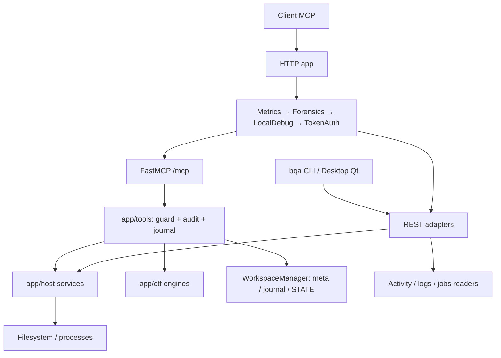

# Review BotQuangAnh MCP và đề xuất mở rộng tool

Ngày: 2026-09-08. Nguồn: checkout `/home/undertaker/Downloads/bqa/botquanganh_mcp`, nhánh `feature/vjp-pro`, commit `d1b304e94284a72534997f3d570714ef7039e970`.

Đây là báo cáo review và phương án đề xuất, chưa phải thiết kế triển khai đã được duyệt. Không sửa mã ứng dụng, cài dependency, restart service hoặc thay đổi cấu hình triển khai. Đánh giá dựa trên source, test cục bộ và hai kiểm tra chức năng lành tính. Các nhận định bảo mật dựa trên đọc luồng mã, không thực hiện khai thác hay kiểm tra endpoint công khai. Không đọc nội dung secret để đưa vào báo cáo.

## 1. Kết luận tổng thể

Dự án đã có nền tảng vận hành đáng kể: host services tách khỏi MCP, REST/CLI, desktop Qt, giới hạn tiến trình, audit có redaction, workspace journal và test contract. Tuy nhiên, mức độ tích hợp giữa các lớp chưa đồng đều. Có những cấu hình và tính năng được công bố nhưng chưa được nối vào đường chạy thực tế.

Phù hợp nhất hiện tại là công cụ cho một operator tin cậy kiểm soát máy host. Chưa đủ bằng chứng để coi đây là hệ thống cách ly nhiều client/chat hoặc một sandbox thực thi command. `SECURITY.md` cũng thừa nhận shell chạy với quyền tài khoản vận hành.

Hướng đề xuất: củng cố identity/policy/journal dùng chung, sửa các lỗi chức năng đã xác nhận, sau đó thêm một số tool offline hoặc chỉ đọc có output cấu trúc. Không cần viết lại toàn bộ dự án hay xây plugin loader động ở giai đoạn này.

## 2. Bản đồ cấu trúc thực tế

Source hiện có 80 file Python trong `app/`, khoảng 23.196 dòng; `tests/` có 69 file Python, khoảng 18.681 dòng. Đây là thống kê quy mô, không phải độ phủ test.



Sơ đồ biểu diễn đường HTTP; stdio không đi qua HTTP middleware. CLI còn gọi các script lifecycle cục bộ để start/stop/restart, và desktop đọc một số trạng thái/log trực tiếp.

| Lớp | File trọng tâm | Vai trò và điểm cần hiểu khi mở rộng |
|---|---|---|
| Bootstrap | `app/main.py:9` | Đăng ký tool bằng import module tường minh; không có cơ chế tự tìm plugin. |
| Transport | `app/mcp_server.py:344` | Ép Streamable HTTP stateless + JSON; thêm REST, health, debug và middleware. Đang sửa `FastMCP.http_app` ở cấp class, nên thay đổi ảnh hưởng mọi instance trong cùng process. |
| MCP adapters | `app/tools/host.py`, `workspace_tools.py`, `ctf_http.py`, `ctf_suite.py` | Schema, gate chat, chuyển lỗi, audit và journal. Nhiều helper dùng chung hiện nằm dưới tên private của một adapter. |
| Host services | `app/host/paths.py`, `files.py`, `policy.py`, `executor.py` | Resolve path/read-write scopes, filesystem, kiểm tra shell, chạy process. Không phụ thuộc decorator MCP; đây là ranh giới tách lớp tốt. |
| Knowledge | `app/tools/host_knowledge.py`, `app/host/inventory.py`, `knowledge/` | Guide và inventory chương trình cài trên host. `TOOL_CATALOG.json` mô tả executable trên máy; thêm một mục ở đây không tạo MCP tool mới. |
| Chat/workspace | `chat_identity.py`, `chat_workspace.py`, `chat_sweeper.py` | Validate ID, token resume, metadata, journal, STATE cache, quota và archive/retention. Binding metadata và quyền của request hiện chưa nối đầy đủ. |
| REST | `app/rest_api.py` | File/command/knowledge, health, jobs, activity/SSE và logs. Phần file/command gọi thẳng host services. Pool blocking riêng 16 worker giúp tách khỏi health/capabilities. |
| Quan sát | `observability.py`, `logging_audit.py`, `activity_log.py`, `jobs_registry.py` | Request ID, hash catalog, metrics, audit, transcript command và jobs. Có nhiều nguồn trạng thái chưa thống nhất. |
| CLI/Desktop | `app/cli/main.py`, `parser.py`, `client.py`, `desktop_ui.py`, `desktop_qt/` | CLI dùng REST cho host operations; launcher công khai chuyển sang Qt tại `desktop_ui.py:837`. Mã Tkinter cũ vẫn còn, tăng chi phí bảo trì. |
| Lifecycle | `run_mcp_tunnel.sh`, `scripts/start_tunnel_server.sh`, `restart_server_only.sh` | Supervisor quản lý server/tunnel; restart server nhằm giữ URL tunnel. Không kiểm tra live lifecycle trong review này. |
| MCP App UI | `app/ui/ctf_fetch_result.py` và HTML đi kèm | Một resource `ui://...` hiển thị kết quả fetch. Khác với desktop UI chạy trên máy. |

Luồng MCP host điển hình: validate `chat_id` → ghi `op_started` nếu có workspace → host service → chuyển kết quả/lỗi → ghi `op_result` và rebuild STATE. Luồng REST file/command hiện bỏ qua phần attribution/journal này.

Command execution có semaphore, timeout, hai luồng drain stdout/stderr, process group riêng và cleanup. Việc kiểm tra working directory chỉ quyết định nơi khởi chạy; nó không giới hạn mọi filesystem/network effect của chương trình con.

## 3. Catalog: cái gì đã dùng được, cái gì mới là engine

Runtime registration có **17 MCP tool**, được xác nhận bởi `tests/test_tool_surface.py`:

| Nhóm | Tool |
|---|---|
| Sức khỏe/capability (2) | `health_check`, `get_capabilities` |
| Filesystem (7) | `host_list_directory`, `host_read_file`, `host_write_file`, `host_replace_in_file`, `host_append_file`, `host_make_directory`, `host_search_text` |
| Command (2) | `host_check_command`, `host_run_command` |
| Knowledge (1) | `host_knowledge` |
| Workspace/note (2) | `host_workspace_bind`, `host_save_note` |
| CTF (3) | `ctf_fetch_url`, `ctf_render_fetch_result`, `ctf_triage_artifact` |

Các engine có source và test nhưng chưa được expose qua MCP adapters:

- `app/ctf/transforms.py`: 12 phép biến đổi byte/text xác định, gồm base64/hex/URL, gzip/zlib, ROT13 và XOR với khóa cho sẵn. Giới hạn input 128 KiB, output 512 KiB; không gọi shell hoặc network.
- `app/ctf/artifact_profile.py`: magic, hash có nêu chế độ full/sample, entropy, manifest ZIP/TAR có giới hạn; không giải nén hoặc chạy artifact. Mở file dựa vào descriptor trong active case, kiểm tra file bị thay đổi.
- `app/ctf/case_scope.py`: metadata và ranh giới case/artifact. Profiler phụ thuộc active case, vì vậy không thể chỉ thêm một decorator rồi coi toàn bộ flow đã hoàn chỉnh.
- `app/ctf/target_request.py`: engine request có scope; sự tồn tại của engine không đồng nghĩa được đăng ký hoặc sẵn sàng công bố. Đây không phải ưu tiên của đợt mở rộng offline được đề xuất.

`ctf_triage_artifact` và profiler mới có phần trùng nhau nhưng không thay thế hoàn toàn: triage có ELF/PE và checksec; profiler tập trung provenance, giới hạn đọc và manifest. Nên giữ chức năng riêng, tái sử dụng helper phù hợp và làm rõ phần nào được đọc đầy đủ.

## 4. Findings cần xử lý

P1: ưu tiên trước mở rộng public/multi-chat hoặc vì làm hỏng tính năng chính. P2: ảnh hưởng tính đúng, khả năng vận hành hoặc bảo trì. Các finding tĩnh bên dưới không phải khẳng định đã xảy ra sự cố trên runtime đang triển khai.

### F1 — P1: Chat isolation chưa được thi hành trong host operations

`HOST_CHAT_ISOLATE` được parse tại `app/config.py:275` nhưng không được dùng bởi path resolver hoặc host adapters. `app/host/paths.py:193` chỉ biết global workspace/read-write scopes. `_guard_chat_id` tại `app/tools/host.py:179` kiểm tra metadata tồn tại, không đưa root của chat vào resolver.

Tác động: bật cấu hình này chưa tạo ra bảo đảm thao tác host thuộc workspace riêng của chat; path tương đối vẫn theo default toàn cục. README và `.env.example` đang hứa nhiều hơn code thực hiện.

Đề xuất: một OperationContext mang identity đã xác thực và effective workspace root; tất cả thao tác đọc/ghi/cwd áp dụng cùng context. Với shell, phải công bố riêng giới hạn thực tế và dùng cách ly OS nếu cần kiểm soát effect ngoài cwd.

### F2 — P1: REST và MCP áp dụng identity khác nhau

`app/rest_api.py:643` trở đi gọi thẳng filesystem/executor, trong khi `app/tools/host.py:327` trở đi thực hiện guard và workspace journal. Gateway auth vẫn bao quanh HTTP khi bật; vấn đề là attribution/isolation cấp chat không được áp dụng giống nhau.

Đề xuất: REST và MCP cùng gọi một operation service. Nếu REST là mặt quản trị dành riêng operator, cần encode và tài liệu hóa quyền đó rõ ràng; không đặt nó cùng trust boundary với client chat rồi giả định `enforce` bảo vệ cả hai.

### F3 — P1: Token resume chưa trở thành quyền của các call tiếp theo

`host_workspace_bind` có kiểm tra resume token và trả session token (`app/tools/workspace_tools.py:101`). Nhưng host calls sau chỉ nhận `chat_id`; `_guard_chat_id` không xác thực token (`app/tools/host.py:144`). ContextVar trong `app/chat_identity.py:56` có helper nhưng chưa được nối vào transport production.

Đề xuất: phân biệt ID dùng gắn nhãn với credential/capability xác nhận quyền workspace. Với transport stateless, phải xác thực capability mỗi request hoặc liên kết nó với identity xác thực ở transport, rồi bind/reset context trong phạm vi request. Không chỉ gọi ContextVar một lần ở bind và trông chờ nó tồn tại qua request khác.

### F4 — P1: Chính sách bảo vệ secret không đồng nhất

Hai đường cần sửa riêng:

- `_build_environment()` tại `app/host/executor.py:112` sao chép `os.environ` khi bật inheritance; chỉ bỏ tập biến injection. `_SENSITIVE_ENV_MARKERS` được khai báo nhưng không dùng. README nói token/secret được lọc, trong khi code và test hiện cho phép kế thừa chúng.
- `search_text()` tại `app/host/files.py:349` authorize root, sau đó mở từng file con tại dòng 387 mà không áp deny-glob của resolver cho từng candidate. Direct read và recursive search vì vậy không có cùng bảo đảm.

Đề xuất: xác định contract môi trường tối thiểu, không truyền gateway credential sang child; áp policy trên từng candidate search và prune directory bị deny. Kiểm tra bằng fixture secret giả khi triển khai sửa, không dùng secret thật.

### F5 — P1: Activity reader chưa validate chat path

REST nhận `chat_id` bằng `.strip()` (`app/rest_api.py:824`, `849`), rồi `_journal_activity_records` nối trực tiếp nó vào root (`app/rest_api.py:250`). Không đi qua validator chat ID chung hay kiểm tra containment tại đây.

Tác động tĩnh: ranh giới đọc các file journal có thể lệch khỏi chat root khi input không hợp lệ. Không thực hiện request tái lập trong review này.

Đề xuất: validate ID, xác thực quyền chat, dùng reader neo vào root và kiểm tra metadata; từ chối ID không hợp lệ trước mọi I/O, áp dụng cho cả snapshot và SSE.

### F6 — P1: `ctf_fetch_url` trả lỗi dù fetch thành công

`app/tools/ctf_http.py:184` gọi `_record_tool_call(..., ok=...)`, nhưng signature ở `app/tools/host.py:206` không nhận `ok`.

Đã xác nhận bằng mock response thành công, không có network: wrapper trả `ok=false`, code `INVALID_ARGUMENT`, message `_record_tool_call() got an unexpected keyword argument 'ok'`. Đây là lỗi nội bộ bị quy nhầm thành lỗi tham số người gọi. Request thực có thể đã hoàn tất trước lỗi này; retry từ client có thể lặp fetch.

Đề xuất: đồng bộ contract helper và wrapper, giữ kết quả fetch đúng, thêm happy-path test ở cấp MCP adapter. Test hiện chỉ kiểm success của service thấp hơn, chưa bảo vệ đường wrapper thành công.

### F7 — P2: Triage suy diễn kết quả âm tính từ mẫu thiếu

`app/ctf/triage.py:474` chỉ đọc 2 MiB đầu của file lớn. `parse_elf()` vẫn mặc định canary/PIE/stripped và trả các giá trị chắc chắn khi bảng cần thiết nằm ngoài mẫu (`app/ctf/triage.py:319`).

Bằng chứng lành tính trên `/usr/bin/python3.13`, 6.812.336 byte: cùng parser đọc đủ cho `canary=true`, 25 section trả về; đọc mẫu 2.097.152 byte cho `canary=false`, 0 section. So sánh này chứng minh thiếu mẫu làm thay đổi kết luận, không phải một lần chạy checksec độc lập.

Đề xuất: đọc có giới hạn theo offset bảng ELF/PE, hoặc trả `unknown` kèm `complete=false`, vùng đã đọc và lý do thiếu. Entropy và strings có thể tiếp tục dùng sampling. Chưa tìm thấy bằng chứng không đồng nghĩa tính năng bảo vệ không tồn tại.

### F8 — P1/P2: Journal lock và độ bền chưa khớp đường gọi thực

Lock ở `WorkspaceManager` thuộc từng instance (`app/chat_workspace.py:697`), nhưng `_begin_workspace_journal` và `_finish_workspace_journal` tạo manager mới mỗi lần (`app/tools/host.py:259`, `291`). `_append_op` đọc/sửa sequence và rotate dưới lock instance (`app/chat_workspace.py:902`). Đây là rủi ro race giữa các request cùng chat; chưa chạy stress hay tái lập mất dữ liệu.

Append journal chỉ `os.write` rồi close tại `app/chat_workspace.py:936`, không fsync journal trước khi tiếp tục. Vì vậy chưa đủ bảo đảm write-ahead qua mất điện. Một số đường journal còn best-effort: lỗi được log rồi operation vẫn tiếp tục.

Đề xuất: manager dùng chung theo root cùng file lock/transaction per workspace; xác định rõ điều kiện journal failure có chặn side effect hay không. Nếu cam kết durable start thì fsync record trước effect và directory sau create/rotate. STATE là cache dựng lại, không nên trở thành nguồn authority.

### F9 — P2: Jobs API chưa theo dõi operation thật

`app/jobs_registry.py` có register/start/finish, nhưng production chưa nối các phương thức này vào executor/operation lifecycle; REST chỉ đọc singleton (`app/rest_api.py:154`). Vì vậy chưa thể dựa vào `/jobs` để chứng minh tác vụ đang chạy hoặc đã hoàn thành. Registry ở RAM cũng mất khi restart và có thể evict record còn active khi đầy (`app/jobs_registry.py:117`).

Đề xuất: nối một `operation_id` thống nhất vào journal và registry trước khi expose jobs tools. Read-status là bước đầu; durable background execution/cancel là một subsystem khác, cần thiết kế vòng đời riêng.

### F10 — P1 khi public exposure: Defaults không tương ứng nhãn production an toàn

`.env.example:8` đặt auth false; dòng 51 đặt output limit 0, tức giữ output không giới hạn trong RAM (`app/host/executor.py:137`), cùng concurrency 100. Khi chưa có cấu hình workspace, code còn mặc định home directory (`app/config.py:164`).

Đây là đánh giá cấu hình mẫu/fallback, không phải xác nhận runtime live đang dùng các giá trị đó. `SECURITY.md` đã nói production phải bật auth nhưng README lại gọi mẫu là production an toàn.

Đề xuất: phân biệt profile local/dev với public HTTP; chặn hoặc yêu cầu quyết định operator rõ ràng trước public exposure thiếu auth; chọn byte/process budgets hữu hạn theo tài nguyên. Health/status nên công bố policy hiệu lực đã redacted.

### F11 — P2: Debt ở contract và integration

- `docs/ARCHITECTURE.md` ghi 16 tool; actual là 17. `CLAUDE.md` còn ghi FastMCP 3.4.0, còn dependency và mã transport là 3.4.7.
- Tool list bị lặp giữa registration, `HOST_TOOLS`, tests và docs. Engine đang có còn gợi ý `ctf_transform` trong output trong khi tool chưa được đăng ký (`app/ctf/artifact_profile.py:308`).
- Origin rejection dùng `FORBIDDEN_ORIGIN` (`app/mcp_server.py:96`), nhưng `ERROR_SPECS` không có code này; formatter rơi về `INTERNAL_ERROR` dù response là 403.
- Helpers private của `app/tools/host.py` đang được nhiều adapter import. Lỗi F6 là ví dụ contract nội bộ không được kiểm tra xuyên adapter.
- Monkey patch `FastMCP.http_app` ở cấp class và nhiều side effect import làm app factory/test isolation khó hơn. Pin dependency giúp giảm rủi ro nhưng không loại bỏ coupling này.

Đề xuất: ưu tiên helper operation/context công khai và contract test; dùng registry metadata chung cho capability/docs, nhưng giữ một contract manifest được reviewer duyệt để bắt việc vô tình thêm/bỏ tool. Có thể chuyển sang server subclass/factory trong một thay đổi riêng sau khi test transport ổn định.

### Các điểm bổ sung cần đưa vào backlog hardening

- Path validation rồi mở bằng pathname còn có khoảng race ở parent directory; final `O_NOFOLLOW` không tự bảo vệ mọi parent. Mở theo dirfd xuyên suốt sẽ nhất quán hơn với profiler mới.
- Command policy kiểm tra một số target tương đối dựa vào default directory (`app/host/policy.py:202`), trong khi executor resolve cwd riêng sau policy (`app/host/executor.py:184`). Cần cùng một cwd hiệu lực; regex không thể biến shell tổng quát thành sandbox.
- Origin validation hiện dùng so sánh chuỗi và fallback theo Host request. Nên parse và so khớp origin cấu hình chuẩn hóa; thêm contract test mà không dựa vào endpoint thật.
- `list_directory` sort cả directory rồi mới cắt số kết quả; giới hạn output chưa phải giới hạn công việc. Cần count/deadline budget riêng.

## 5. Phương án thêm tool

### So sánh ba hướng

| Hướng | Lợi ích | Chi phí/rủi ro | Đánh giá |
|---|---|---|---|
| A. Thêm adapter trực tiếp theo mẫu hiện tại | Nhanh, tận dụng engine có sẵn | Tiếp tục nhân bản guard/journal; REST-MCP càng lệch | Chỉ thích hợp prototype rất nhỏ sau khi sửa lỗi hiện hữu |
| B. Operation service dùng chung + tool theo nhu cầu | Policy, identity, audit và result nhất quán; tái dùng qua REST/MCP | Cần củng cố một lớp hẹp trước | **Đề xuất chọn** |
| C. Plugin loader động + background workflow tổng quát | Mở rộng lớn về dài hạn | Thêm trust boundary, versioning, lifecycle, discovery và migration | Chưa có nhu cầu đủ rõ để trả chi phí này |

### Danh sách ưu tiên

| Ưu tiên | Tool đề xuất | Contract dự kiến | Tái dùng / điều kiện |
|---|---|---|---|
| 1 | `ctf_transform` | Một operation rõ ràng, đúng một input carrier text/base64; output byte lossless, số byte và warning có giới hạn | `app/ctf/transforms.py`; thêm wrapper, envelope, attribution và round-trip tests |
| 1 | `host_workspace_status` | Workspace của caller, usage/quota, pending operations, resume hint; không trả token hoặc nội dung private của chat khác | Identity/capability đúng trước; đọc metadata/STATE với budget và chỉ rõ trạng thái cache |
| 2 | `host_file_info` | Một path trong scope; type/size/mtime và hash tùy chọn có budget; nói rõ full/sample | File service mở an toàn; giảm các lần gọi shell để xem metadata |
| 2 | `ctf_case_create` / `ctf_case_status` | Tạo hoặc đọc metadata case cục bộ; không tự gửi request hay chạy artifact | Adapter cho case lifecycle; create là write, status là read; identity và idempotency rõ ràng |
| 2 | `ctf_profile_artifact` | Một filename trong active case; magic, hash, entropy, bounded archive manifest và evidence | `artifact_profile.py`; cần flow case tạo/đặt artifact rõ ràng, không auto-extract |
| 3 | `host_job_status` | Tra cứu operation ID thuộc caller; state, timestamps và excerpt đã redacted | Chỉ thêm sau khi job lifecycle thực sự được nối; nêu rõ retention/restart semantics |
| 3 | `host_diagnostics` | Health, phiên bản dependency, effective limits/policy và tình trạng journal | Dùng service đọc đã bounded; phần cấu hình quản trị chỉ dành operator |

Nếu chưa có ưu tiên sản phẩm cụ thể, đợt đầu nên là `ctf_transform` và `host_workspace_status`. Tool đầu ít dependency và giúp giảm script lặt vặt; tool sau giải quyết việc biết mình đang ở workspace nào và tiếp tục công việc từ đâu. Đợt hai mới hoàn thiện case/profile để lưu bằng chứng có provenance.

### Cấu trúc mở rộng đề xuất

```text
app/main.py                   registration tường minh
app/tools/<feature>.py        MCP schema/annotations, adapter mỏng
app/operations/context.py     identity/capability và effective scope
app/operations/service.py     policy → start → service → terminal result
app/host/ hoặc app/ctf/       nghiệp vụ độc lập transport
app/rest_api.py               adapter dùng cùng operation service
app/error_contract.py         error/result contract dùng chung
```

Đường chạy chung: authenticate → tạo OperationContext → validate schema/scope/budget → ghi start theo durability đã chọn → gọi engine → chuẩn hóa result → ghi terminal outcome. Pure transforms không cần filesystem authority nhưng vẫn phải có budget và contract trả lỗi rõ ràng. Không ghi raw input/output nhạy cảm vào audit.

Mọi tool mới cần xác định rõ read/write, timeout/count/byte cap, `readOnlyHint`/`destructiveHint`/`openWorldHint`/`idempotentHint` phù hợp. Annotation là metadata cho client, không thay thế kiểm soát quyền ở server.

Với result lớn, ưu tiên summary có `truncated`, `complete` và artifact reference; tránh lặp cùng binary payload ở cả text và structured output. Artifact reference cũng phải được authorize khi đọc.

Các điểm phải cập nhật khi thêm tool: engine/service, MCP adapter và import trong main; capability manifest; error schema nếu có mã mới; guide/catalog MCP; wrapper tests; transport integration. Chỉ thêm REST/CLI/UI nếu người dùng của tính năng cần chúng, không bắt buộc mọi tool phải có ba giao diện.

## 6. Kiểm chứng và giới hạn

Lượt đầu chọn 10 file test thông thường: **146 pass, 9 fail**. Hai fail là dependency closure do thiếu `PySide6-Essentials` và `shiboken6` trong `.venv`. Bảy fail progress do môi trường có `NO_COLOR=1`; fixture chỉ xử lý TERM/BQA_NO_PROGRESS, chưa cô lập NO_COLOR.

Chạy lại sau khi bỏ riêng NO_COLOR cho tiến trình test: **153 pass, 2 fail trong 1,57 giây**; hai fail còn lại đều thuộc dependency closure. Điều này phân biệt lỗi fixture/môi trường với lỗi product. Không cài dependency để che tình trạng checkout. Command của nhóm kiểm chứng:

```bash
env -u NO_COLOR HOST_READ_SCOPE= HOST_WRITE_SCOPE= .venv/bin/python -m pytest -q \
  tests/test_tool_surface.py tests/test_health.py tests/test_config_env_parity.py \
  tests/test_dependency_check.py tests/test_cli_parser.py tests/test_cli_output.py \
  tests/test_cli_progress.py tests/test_release_readiness.py \
  tests/test_ctf_transforms.py tests/test_ctf_triage.py
```

Nhóm bổ sung `test_cli_progress.py` và `test_error_contract.py` có 27 pass khi bỏ NO_COLOR. Test Streamable HTTP timeout 30 giây trong sandbox, nhưng cùng test **1 pass trong 0,95 giây** khi chạy ngoài sandbox bằng quyền pytest đã cho phép. Vì vậy không ghi nhận timeout đó là bug transport.

Hai kiểm tra chức năng bổ sung:

1. Mock fetch thành công ở `ctf_http.fetch_ctf_url`, giữ helper audit thật: xác nhận F6, không có request mạng.
2. Đọc binary Python cục bộ, so sánh `parse_elf(full)` với `parse_elf(first_2MiB)`: xác nhận F7, không thực thi artifact.

Không chạy full suite, strength/fuzz, kiểm tra khai thác, desktop GUI, public tunnel, packaging clean-install hoặc dependency CVE audit. Unit test engine hiện có không chứng minh các engine chưa đăng ký đã dùng được từ MCP. Findings về race và boundary là kết luận đọc source, chưa đo xác suất hay xác nhận ảnh hưởng live.

## 7. Thứ tự thực hiện đề xuất

1. Sửa F6 và diễn đạt đầy đủ/không đầy đủ của triage; bổ sung test đúng cấp wrapper.
2. Củng cố capability per request, effective chat root, parity REST/MCP, secret/search/activity boundary; thống nhất profile public/local.
3. Sửa locking/durability journal và nối lifecycle nếu cần jobs; sửa docs/manifest cùng thay đổi tương ứng.
4. Triển khai đợt tool nhỏ: transforms + workspace status; kiểm tra luồng từ MCP đến result với fixture hợp lệ.
5. Hoàn thiện case/profile và provenance; chỉ mở rộng jobs hoặc diagnostics theo nhu cầu đã chọn.

Tiêu chí hoàn tất một tool: caller nhìn thấy trong tools/list và capabilities; happy path trả đúng schema; policy giống nhau ở mọi adapter có expose; lỗi không bị nhầm thành thành công; output/budget rõ ràng; audit gắn đúng operation/chat; tài liệu không hứa vượt bảo đảm của implementation.
