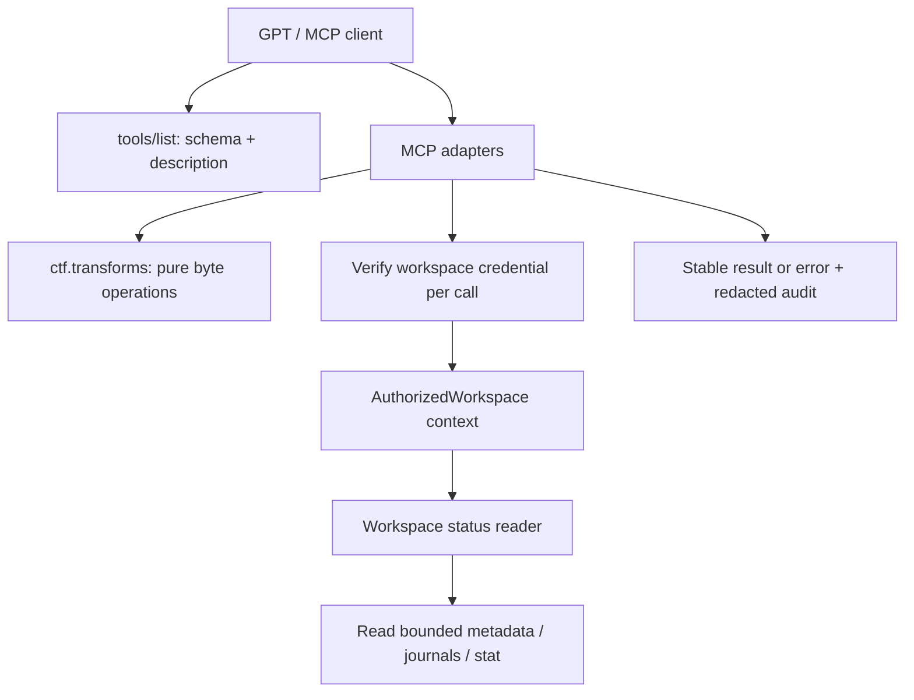

# Đề án nâng cấp BotQuangAnh MCP: hai tool thiết yếu và khả năng GPT chọn đúng

**Ngày:** 2026-09-08.
**Cập nhật điều kiện triển khai:** 2026-09-10; xem [đề án tổng hợp](2026-09-10-botquanganh-upgrade-proposal.md).
**Trạng thái:** Đề xuất để review; chưa phê duyệt triển khai.
**Baseline review ngày 08/09:** `feature/vjp-pro`, commit `d1b304e94284a72534997f3d570714ef7039e970`, 17 MCP tools. Đây là mốc lịch sử, không xác nhận trạng thái runtime ngày 10/09.
**Phạm vi:** `ctf_transform`, `host_workspace_status`, adapter/context tối thiểu cần thiết, metadata, kiểm chứng và phát hành theo đợt.
**Tài liệu nền:** [Review kiến trúc](../../reviews/2026-09-08-mcp-architecture-and-tool-proposals.md).
**Bộ đánh giá lựa chọn tool:** [Các tình huống nghiệm thu](../evals/2026-09-08-two-tool-selection.md).

## 1. Mục tiêu và quyết định chính

Thêm hai khả năng có tần suất sử dụng cao: biến đổi byte/text chính xác mà không phải dựng shell script; lấy trạng thái workspace được phép truy cập để tiếp tục công việc. Một tool chỉ được coi là hoàn thành khi có thể được phát hiện, gọi đúng tham số, trả kết quả đúng và được GPT chọn từ yêu cầu tự nhiên.

Điều kiện bắt buộc theo yêu cầu người dùng: nghiệm thu UI và MCP trên đúng runtime trước khi triển khai hai tool. Kết quả kiểm tra cũ không thay thế nghiệm thu sau cùng; bước sửa runtime trước đó đã bị gián đoạn nên chưa được ghi nhận hoàn tất trong đề án này.

Đề xuất chia hai đợt độc lập sau khi điều kiện trên đạt:

1. **Đợt A — 18 tools:** expose engine `transforms` đã có, bổ sung metadata và kiểm thử từ MCP đến engine.
2. **Đợt B — 19 tools:** thêm status service chỉ đọc, xác thực quyền workspace cho từng call, snapshot có giới hạn và kiểm thử lựa chọn tool.

Mỗi đợt có thể review/rollback riêng. Không coi việc chấp thuận viết đề án là chấp thuận sửa code, restart hoặc publish runtime.

## 2. Tại sao chọn hai tool này

| Tool | Vấn đề hiện tại | Giá trị đo được |
|---|---|---|
| `ctf_transform` | Mỗi thao tác encode/decode nhỏ thường phải tạo câu lệnh, xử lý quoting và diễn giải stdout | Trong bài đánh giá, phép biến đổi thuộc danh sách hỗ trợ hoàn tất bằng một call transform, không cần shell phụ |
| `host_workspace_status` | Thông tin bind, STATE, journal và quota phân tán; dễ nhầm operation chưa có kết quả với process đang chạy | Một call sau khi có credential hợp lệ cho biết workspace được phép đọc, usage có mức đầy đủ rõ ràng và operation chưa có terminal record |

Profiler và case lifecycle chưa thêm trong đợt này vì đã có triage cơ bản và còn phụ thuộc flow case/artifact. Jobs tools chưa thêm vì registry hiện chưa nối với operation thật. Không thêm plugin loader, background execution, tool tự thử nhiều phương án hoặc UI mới.

## 3. Hiện trạng ảnh hưởng thiết kế

- Registration tường minh ở `app/main.py`; tên tool còn lặp ở `app/tools/health.py` và `tests/test_tool_surface.py`.
- `app/ctf/transforms.py` đã có 12 operation, input 128 KiB, output 512 KiB và output Base64 bảo toàn byte.
- Workspace lưu dưới `<HOST_CHAT_ROOT>/<chat_id>/` với `meta.json`, `journal.jsonl`, `journal.jsonl.1`, `STATE.md`, `notes/`.
- Bind hiện trả `session_token`; metadata lưu hash, có sẵn `verify_session_token()` dùng so sánh constant-time. Các host calls cũ chưa dùng credential này như quyền của mỗi request.
- `HOST_CHAT_ISOLATE` chưa được áp dụng vào host resolver. Status mới phải nêu đúng hiện trạng; không được biến giá trị cấu hình thành khẳng định hệ thống đã isolate.
- Journal là bằng chứng về operation, không phải process registry; lock giữa manager instances và fsync chưa đủ để cam kết snapshot giao dịch hoặc phục hồi qua mất điện.
- Baseline kiểm chứng chọn lọc: 153 pass, 2 dependency-check fail vì `.venv` thiếu desktop dependency; test Streamable HTTP riêng đã pass ngoài sandbox. Đây không phải kết quả full suite.

## 4. So sánh cách triển khai

| Cách | Điểm mạnh | Hạn chế | Quyết định |
|---|---|---|---|
| Chỉ thêm decorator vào engine | Nhanh | Thiếu authorization/status semantics, dễ lặp lỗi adapter như fetch hiện có | Không chọn |
| Adapter mỏng + helper context công khai cho phần cần thiết | Tái dùng engine, ranh giới rõ, đủ nhỏ để review | Có một ít mã chung và test contract | Chọn |
| Refactor toàn bộ REST/MCP/isolation trước hai tool | Có thể thống nhất toàn hệ thống | Kéo nhiều thay đổi tương thích vào một tính năng nhỏ | Tách thành đề án nền tảng riêng |

Giới hạn rõ: status reader mới có kiểm soát quyền riêng không sửa được mọi đường truy cập của 17 tool cũ. Đợt này phục vụ triển khai một operator tin cậy. Việc quảng bá hỗ trợ nhiều client không tin cậy hoặc public exposure phải chờ hạng mục hardening riêng.

## 5. Kiến trúc đề xuất

MCP adapter giữ tên, mô tả và schema; engine/service giữ nghiệp vụ; helper context cung cấp giao diện có thể dùng lại. Không import thêm helper private từ `app/tools/host.py` vào các module mới.

Chỉ tách phần validation/attribution cần dùng khỏi adapter hiện tại sang module công khai và giữ forwarding imports cho caller cũ. Không nhân tiện chuyển toàn bộ host services sang kiến trúc khác.

## 6. Contract `ctf_transform`

### Input

| Trường | Kiểu | Quy tắc |
|---|---|---|
| `operation` | enum string | Một trong 12 operation bên dưới |
| `input_text` | string hoặc null | Một nguồn input; UTF-8 |
| `input_base64` | string hoặc null | Nguồn byte đầu vào được vận chuyển bằng Base64 |
| `key_hex` | string hoặc null | Bắt buộc và chỉ được dùng với `xor_hex` |
| `chat_id` | string hoặc null | Theo attribution mode hiện hành; trong enforce phải là chat hợp lệ đã bind |

Danh sách cố định: `base64_encode`, `base64_decode`, `hex_encode`, `hex_decode`, `url_encode`, `url_decode`, `gzip_compress`, `gzip_decompress`, `zlib_compress`, `zlib_decompress`, `rot13`, `xor_hex`.

Phải có đúng một trong `input_text` và `input_base64`. Operation là hành động trên byte được cung cấp; `input_base64` là carrier, không tự chọn thêm phép decode theo nội dung. Ví dụ encode Base64 từ byte nhị phân vẫn nhận byte qua carrier này.

### Kết quả

Thành công: `ok=true`, `schema_version=1`, `operation`, `input_bytes`, `output_bytes`, `output_base64`, `output_text` tùy chọn, `complete=true`.

Giới hạn engine giữ nguyên: tối đa 131.072 byte input và 524.288 byte output. Base64 carrier được kiểm tra độ dài trước decode. UTF-8 text vượt 4.096 byte không lặp lại trong `output_text`; Base64 vẫn chứa đủ output trong giới hạn. `output_text` chỉ có khi output là UTF-8 hợp lệ. Output vượt cap phải lỗi, không trả partial như thành công.

Metadata mới về số byte phải được engine cung cấp hoặc từ một helper chuẩn hóa input dùng chung với engine; adapter không viết parser input thứ hai. Không tự nối nhiều phép biến đổi, đoán encoding, thử khóa hoặc ghi file. Người gọi quyết định bước tiếp theo.

### Error và audit

- Input/schema/codec/key/limit sai: `INVALID_ARGUMENT` có thông báo trường hoặc giới hạn liên quan, không chèn dữ liệu gốc vào message.
- Attribution giữ mã E1/E6 theo contract hiện có; không thay đổi ý nghĩa của 17 tool cũ.
- Lỗi bất ngờ: `INTERNAL_ERROR`, không lộ traceback.
- Audit chỉ ghi tên operation, byte counts, chat ID đã validate, request ID, thời gian và outcome. Không lưu raw input, key hoặc output. Không cần journal operation cho phép tính thuần.
- Test qua MCP phải xác nhận client nhận ra lỗi tool, không chỉ nhìn thấy một JSON `ok=false` bị metrics tính là thành công. Nếu dùng FastMCP result envelope, chọn một adapter error helper công khai và kiểm tra cả wire result lẫn metrics.

## 7. Contract `host_workspace_status`

### Quyền truy cập và identity

Input: `chat_id: str`, `workspace_token: str`. Token chính là credential đã được trả dưới tên `session_token` khi bind; description giải thích rõ ánh xạ tên này. Credential là dữ liệu nhạy cảm, không phải chuỗi mẫu trong tài liệu, không log và không đưa vào câu trả lời cuối của GPT.

Mỗi lần gọi, helper mới validate ID, mở metadata an toàn dưới chat root và xác minh token với hash bằng helper hiện có. Không chỉ kiểm tra `meta.json` tồn tại; không tin ContextVar từ một request trước. Không yêu cầu client gửi custom HTTP header chưa được chứng minh hỗ trợ.

ID sai cú pháp trả E1. ID hợp lệ nhưng workspace/credential không xác thực được trả cùng một lỗi `AUTH_REQUIRED` và thông báo chung để tránh phân biệt workspace tồn tại. Không tự tạo, resume, đổi token, restore hoặc quét workspace khác khi status thất bại. GPT phải dùng credential của phiên; nếu mất credential thì báo cần khôi phục quyền, không tự bind một workspace mới thay thế.

Helper đọc metadata phải có cap 64 KiB, kiểm tra regular file và scope bằng descriptor; không gọi `create_or_bind()` chỉ để xác thực vì hàm đó có thể tạo thư mục và kiểm tra quota theo ngữ nghĩa mutation. Workspace đầy quota vẫn phải đọc được status.

### Snapshot và output

Thành công trả `ok=true`, `schema_version=1`, `observed_at` UTC và các nhóm:

| Nhóm | Nội dung | Ngữ nghĩa |
|---|---|---|
| `workspace` | ID, root của workspace đã xác thực, thời điểm tạo | Không liệt kê workspace khác |
| `policy` | `status_scope_enforced=true`, `host_chat_isolate_configured`, `legacy_host_isolation_verified=false`, `shell_sandboxed=false` | Mô tả bảo đảm thật; không suy diễn flag thành enforcement |
| `usage` | Số byte logic của regular files đã stat, entry count, `complete`, `measured_at`, stop reason | Không khẳng định bằng disk allocation hoặc snapshot giao dịch |
| `quota` | Giới hạn byte hoặc null khi không giới hạn; remaining chỉ tính khi usage đầy đủ | Nếu usage thiếu thì remaining=null |
| `journal` | Khoảng đọc, `complete`, `consistent`, số record lỗi và thời điểm event hợp lệ mới nhất đã thấy | Thời điểm mới nhất trong phần đã đọc không tự nhận là toàn lịch sử |
| `pending` | Tối đa 20 operation không thấy terminal record, `operation_id`, `kind`, `started_at`; coverage/truncated | Đây là unresolved journal operation, không phải danh sách process còn sống |
| `state` | STATE có tồn tại không, mtime; `freshness=unknown` nếu không xác minh được | Không trả raw STATE.md hoặc tự rebuild |
| `warnings` | Mã và thông điệp giới hạn/độ không chắc chắn | Không chứa token, raw command hoặc nội dung note |

Status không sửa nội dung workspace, cập nhật last-activity, tạo op_started hay rebuild STATE. Như vậy hỏi status không tự làm workspace hết idle và không tạo pending operation của chính nó. Chỉ ghi metrics/audit ngoài workspace đích, không dữ liệu nhạy cảm.

### Budget và tính nhất quán

- Usage: tối đa 10.000 entries, depth 64, cooperative deadline 500 ms. Hết budget trả partial có lý do. Không đọc content khi tính usage, không theo symlink. Mỗi entry regular-file tính theo `st_size`; báo rõ đây là logical usage.
- Journal: đọc đuôi tối đa 512 KiB cho mỗi generation hiện tại/trước, tổng tối đa 1 MiB. Nếu bị cắt, chỉ parse các dòng hoàn chỉnh và đặt coverage không đầy đủ; không kết luận pending bằng không cho toàn lịch sử.
- Kiểm tra identity/stat trước và sau snapshot. Nếu generation thay đổi, thử lại tối đa một lần trong budget; sau đó trả `consistent=false` hoặc lỗi chuẩn nếu metadata authority thay đổi.
- Cooperative deadline không phải hard timeout cho I/O filesystem bị treo. Service phải chạy ở worker phù hợp; không chặn event loop. Đợt này không cam kết hỗ trợ filesystem network có latency không kiểm soát.
- Output JSON đã serialize tối đa 32 KiB; cắt danh sách phụ với `truncated=true`, giữ các trường authority/completeness.
- Quota, trạng thái thiếu file và journal lỗi phải phản ánh đúng; không dùng JobsRegistry hiện tại để bổ sung một giá trị `running` chưa có bằng chứng.

## 8. Metadata để GPT biết chọn tool

GPT chọn tool dựa vào metadata; cần đánh giá cả yêu cầu trực tiếp, gián tiếp và trường hợp không nên gọi. Đây là định hướng của [OpenAI về metadata](https://developers.openai.com/plugins/guides/optimize-metadata).

Description đề xuất cho `ctf_transform`:

> Use this when the user supplies bytes or text and requests one supported encoding, decoding, compression, decompression, ROT13, or known-key XOR operation. Prefer this tool over a shell script for these supported operations. Provide exactly one input carrier. It does not detect encodings, try keys, read files, or run programs. For conceptual explanations alone, answer directly.

Description đề xuất cho `host_workspace_status`:

> Use this when resuming work, checking the current chat workspace, inspecting usage or quota, or reviewing operations without a terminal journal record. Provide the chat_id and workspace_token from the authorized binding; workspace_token is the session_token returned by host_workspace_bind. Never invent credentials. This tool reads one authorized workspace and does not create or modify it. Pending journal entries do not prove a process is still running. Do not call it repeatedly when a recent snapshot is sufficient.

Cả hai dùng annotations: `readOnlyHint=true`, `destructiveHint=false`, `openWorldHint=false`, `idempotentHint=true`. Status trả snapshot thay đổi theo thời gian nhưng bản thân call không làm đổi trạng thái nghiệp vụ. Annotation không thay thế authorization.

Cập nhật hướng dẫn trong `app/mcp_server.py` và `knowledge/WORKING_GUIDE.md`:

1. Chọn transforms cho phép biến đổi được hỗ trợ; tool thiếu operation thì dùng phương án khác trong scope người dùng, không giả tên operation.
2. Khi resume hoặc chưa rõ trạng thái workspace, dùng status với credential hợp lệ; trạng thái mới đọc còn đủ thì không gọi lại mặc định trước mỗi tool.
3. Thiếu token hoặc status không đầy đủ phải nói rõ; không tự suy diễn path, remaining quota hoặc process state.
4. Giữ hướng dẫn nhận diện file qua triage, đồng thời sửa diễn đạt chắc chắn quá mức về isolation hiện tại.

`get_capabilities` và contract manifest lần lượt là 18 và 19 tools; cập nhật features/limits liên quan. Không dùng `knowledge/TOOL_CATALOG.json` của executable host làm registry MCP. Giữ danh sách kỳ vọng độc lập trong test để reviewer thấy việc thêm tool rõ ràng.

## 9. File và trách nhiệm dự kiến

Các path chưa có dưới đây là đề xuất thiết kế, không phải file đã triển khai.

| File | Loại thay đổi | Trách nhiệm |
|---|---|---|
| `app/ctf/transforms.py` | Sửa nhỏ | Trả byte counts từ input chuẩn hóa; giữ semantics codec |
| `app/tools/ctf_transforms.py` | Tạo | Schema/description/annotations và MCP wrapper |
| `app/tool_context.py` | Tạo | Validation/attribution dùng chung có giao diện công khai; không chứa tool decorators |
| `app/tools/host.py` | Sửa giới hạn | Chuyển tiếp helper đã tách, giữ signature caller hiện có |
| `app/workspace_access.py` | Tạo | Verify credential và trả context/descriptor workspace đã được phép đọc |
| `app/workspace_status.py` | Tạo | Snapshot bounded, completeness/consistency và output schema |
| `app/tools/workspace_tools.py` | Bổ sung | Wrapper `host_workspace_status`, bind description giải thích credential |
| `app/main.py`, `app/tools/health.py` | Sửa | Registration, capabilities, limits |
| `app/mcp_server.py`, `knowledge/WORKING_GUIDE.md` | Sửa | Hướng dẫn chọn/phối hợp tool |
| `README.md`, `docs/ARCHITECTURE.md`, `docs/CHAT_WORKSPACES.md` | Sửa | Catalog, bảo đảm thực tế và usage |
| `tests/test_ctf_transform_tool.py` | Tạo | Wrapper, wire result, error/audit behavior |
| `tests/test_workspace_status.py` | Tạo | Credential, snapshots, quota, partial/consistency bằng fixture |
| `tests/test_tool_surface.py`, `test_health.py`, `test_enforce_gating.py` | Sửa | Catalog và compatibility |
| `tests/test_streamable_http.py` | Bổ sung có giới hạn | Listing và call hai tool trong transport thật qua client cục bộ |

Không thêm REST route, CLI subcommand hoặc desktop widget cho hai tool ở đợt đầu. Nếu bổ sung sau, chúng phải dùng cùng service/context, không tạo reader bỏ qua quyền riêng.

## 10. Kế hoạch nghiệm thu

### A. Chức năng và contract

- 12 operation cho byte output đúng với standard codec/reference đã có; round-trip phù hợp.
- Tham số thiếu/xung đột/operation không hỗ trợ/UTF-8 không hợp lệ cho ROT13 trả lỗi chuẩn; invalid binary output vẫn giữ đúng carrier.
- Byte/representation limits được thực thi; key/input/output không xuất hiện trong audit.
- Happy path từ MCP wrapper thực sự đến engine, để bắt lỗi signature ở adapter mà test engine riêng không thấy.
- Status token đúng đọc được workspace đích; mất/sai token không fallback sang global workspace; test bằng credential và file fixture tổng hợp.
- Workspace đầy quota vẫn đọc status; status không thay metadata, journal, STATE hoặc last-activity.
- Journal bị cắt/rotate/incomplete không bị trình bày như snapshot đầy đủ; pending không được gọi là live process.
- Status usage dừng ở budget, remaining=null khi thiếu; output nằm trong cap.
- Signature/schema của 17 tools cũ giữ tương thích, ngoại trừ sửa docs nêu đúng hành vi; catalog chỉ thêm tool theo từng đợt.

### B. Lựa chọn tool của GPT

Chạy bộ 20 tình huống ở tài liệu eval kèm theo, mỗi tình huống ba lần trong hội thoại sạch với cùng model/client/metadata revision. Các case cần workspace dùng fixture binding được tạo hợp lệ; không in token vào báo cáo kết quả.

Mục tiêu nghiệm thu đề xuất, chưa phải kết quả đạt được:

- 15 case cần chọn tool đúng: ít nhất 43/45 lượt chọn đúng tool và tham số hợp lệ; không case nào sai cả ba lượt.
- 5 case giải thích/không đủ quyền/ngoài phạm vi: 15/15 không có call không phù hợp. Case thiếu credential phải không gọi status bằng credential đoán hoặc tạo workspace thay thế.
- Không shell call phụ cho phép transform thuộc phạm vi và đã có input đầy đủ.
- Case dữ liệu chưa đầy đủ T15 phải nêu giới hạn ở cả ba lượt. Không báo process còn chạy chỉ từ pending journal; không công bố raw token trong câu trả lời.

Nếu không đạt: sửa một trường metadata hoặc schema mỗi lần, refresh rồi chạy lại case ảnh hưởng và negative set. Không thêm các mệnh lệnh ép gọi tool cho mọi yêu cầu để nâng tỷ lệ gọi giả tạo.

### C. Xác nhận sau cập nhật server

Kiểm tra catalog, schema, annotations, hash catalog và một call lành tính cho mỗi tool từ đúng server đã cập nhật. Với ChatGPT Developer mode: cập nhật/restart server, Refresh kết nối, xác nhận metadata đổi rồi mở hội thoại mới; metadata của plugin đã publish cần quy trình phiên bản được review riêng. [OpenAI: cập nhật metadata](https://developers.openai.com/plugins/deploy/connect-chatgpt#refresh-metadata).

## 11. Lộ trình, phụ thuộc và mốc quyết định

| Mốc | Deliverable | Điều kiện chuyển bước |
|---|---|---|
| M0 — xác nhận thiết kế | Duyệt hai contract, quyền của status và phạm vi trusted operator | Người dùng duyệt đề án trước implementation |
| M1 — ổn định UI/MCP | Xác định runtime chuẩn, hoàn tất sửa lỗi đã xác nhận, kiểm tra UI/transport/lifecycle/dependency | Nghiệm thu theo giai đoạn 0 của đề án tổng hợp; ghi revision/PID/kết quả mới, bảo toàn URL đang dùng |
| M2 — đợt A | Transform wrapper + metadata + 18-tool catalog | Unit/adapter/transport và eval transform đạt |
| M3 — đợt B | Workspace access/status + metadata + 19-tool catalog | Read-only/credential/budget/partial tests và eval status đạt |
| M4 — release review | Diff, kết quả kiểm chứng, catalog/version và rollback cụ thể | Duyệt bản cập nhật runtime khi chưa có authorization triển khai |
| M5 — cập nhật client | Server đúng revision, metadata client mới và smoke tests | Hai tool được nhìn thấy và chọn đúng trong client sử dụng thực tế |

Đây là lộ trình thiết kế, không phải implementation plan từng commit. Sau M0 mới lập hai implementation plan độc lập theo Superpowers: đợt A transforms và đợt B workspace status. Không ước lượng ngày hoàn thành trước khi xác nhận environment và mức thay đổi helper compatibility.

## 12. Rủi ro và rollback

- **Helper dùng chung gây regression:** giữ signature forwarding cho caller cũ, test adapter toàn bộ caller liên quan; không thay đổi helper chỉ dựa vào một test engine.
- **Token xuất hiện trong log:** audit chỉ allowlist metadata không nhạy cảm; kiểm tra cả exception, journal, transport debug và bản ghi eval. Không thu raw tool arguments vào report.
- **Snapshot bị hiểu quá mức:** schema luôn có coverage/consistency; instructions giải thích unresolved khác running, configured khác enforced.
- **Output transform lớn:** giữ engine cap, chỉ lặp text nhỏ, đo kích thước wire response; payload vượt cap lỗi rõ ràng.
- **Metadata cũ:** bản release ghi tool list/hash dự kiến; xác nhận client đã refresh, không suy đoán merge là đủ.
- **Rollback:** mỗi đợt có commit/release độc lập; rollback registration, wrapper và metadata tương ứng, restart chỉ server theo quy trình vận hành đã duyệt và refresh client. Không xóa workspace, token hoặc journal. Hai tool không yêu cầu migration định dạng workspace.

Các finding về secret inheritance, search deny policy, REST activity boundary, global isolation và journal durability vẫn cần hardening riêng. Chúng là điều kiện trước khi công bố môi trường nhiều client không tin cậy; không được ghi “đã sửa” trong release hai tool nếu không có thay đổi và kiểm chứng tương ứng.

## 13. Definition of Done

- Hai tool có behavior/schema/annotations đúng đề án, output và error kiểm tra qua MCP.
- Engine transforms được tái sử dụng, không có shell/network/file side effect mới.
- Status authorize mỗi call, chỉ đọc workspace đích, không lộ credential và không làm mới hoạt động.
- GPT chọn đúng theo bộ eval và các ngưỡng đã chốt; lưu số đo thực tế, không ghi đạt từ việc tests Python pass.
- Catalog, capabilities, server instructions, guide và docs nhất quán 19 tools sau cả hai đợt.
- Báo cáo release nêu chính xác test đã chạy, case còn thiếu, giới hạn snapshot/isolation và rollback.
- Việc merge, cập nhật runtime và cập nhật metadata client được ghi nhận là các bước riêng.
